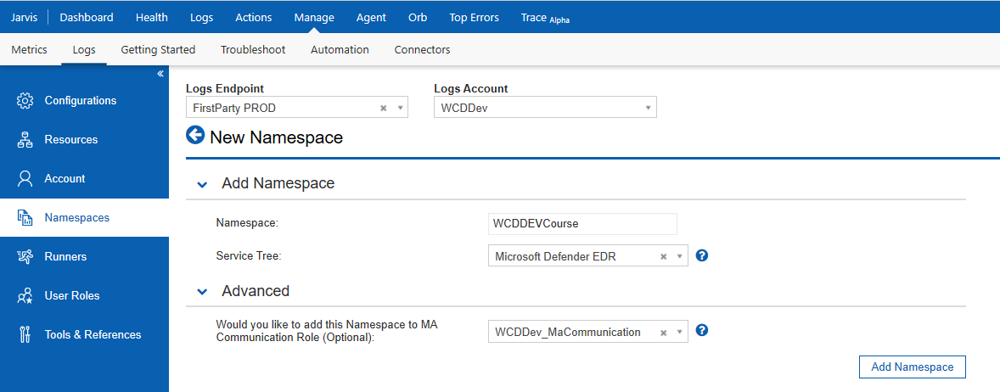
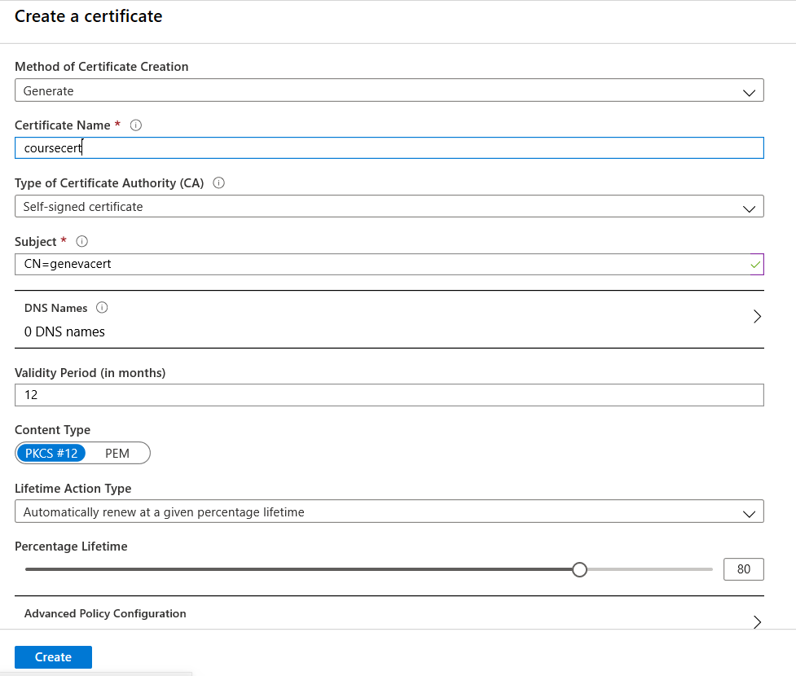
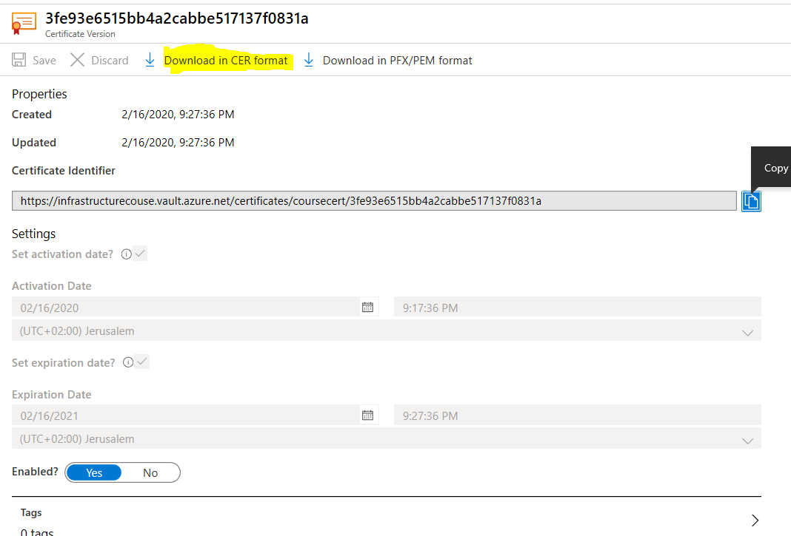
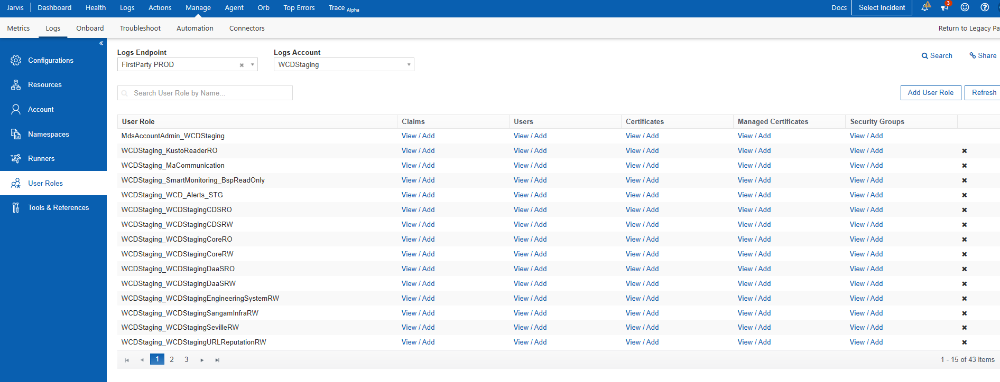
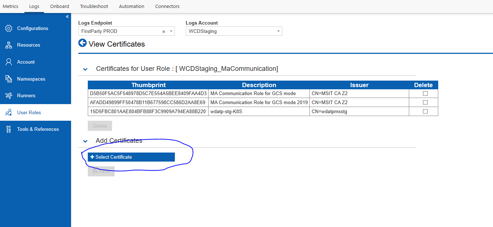
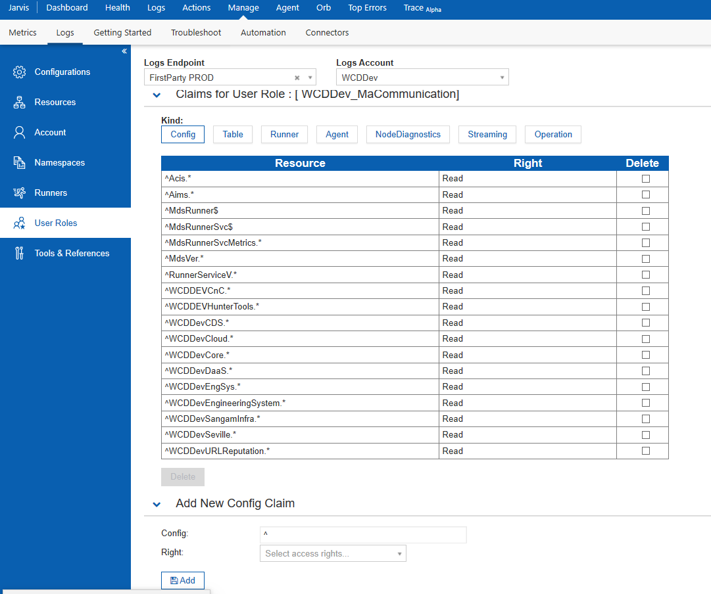
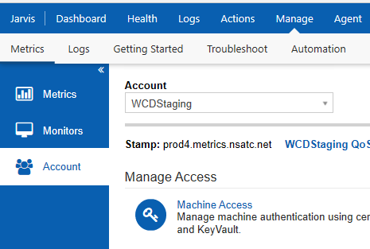

# Logs

## Lab goals
- Download and understand log-tailer chart
- Deploy log tailer
- Create self-signed certificate and give permission to Geneva for this certificate
- Create Geneva namespace and configuration
- Download, configure and deploy Geneva logger
- Deploy containers that send `hello world` logs
- Validate logs arrival in Geneva

## Let's start!
### Identity permissions
In order the cluster will be able to pull images from ACR, add acrPull permissions to the ACR that was created in the previous lab:  
  
  
  
  
Also, please give `Get` permission to the key vault (so that Geneva containers will be able to pull the certificate):  
  
  
  


### Download log tailer chart
The following commands need password, that will be provided during the lab:
```
az login --service-principal -u 0f6a9b10-0ee9-4ae7-9c4e-9ddb192617b7 -p <Application secret (provided during the Lab)>  --tenant 72f988bf-86f1-41af-91ab-2d7cd011db47

az configure --defaults acr=infraStructureCourse 

az acr helm repo add

helm update

helm search log-tailer

helm fetch infraStructureCourse/log-tailer
```

Log tailer chart configuration:
- Extract the log-tailer tgz file
- In log-tailer/values/helm-stg-values.yaml replace the ACR to the one that you created
- Run the following commands:
```
helm upgrade --install log-tailer log-tailer --namespace wdatp-infra-system -f log-tailer/values/helm-stg-values.yaml -f log-tailer/values/helm-stg-eus2-values.yaml  --force
```
#### Validation
Run the following command, and make sure you get DaemonSets with 3 containers (3/3):
```
kubectl get pods -n wdatp-infra-system
```

### Configure Geneva server 
#### Namespace creation
Go to Jarvis UI, enter Manage->Namespace->"<namespace_name>", and define the service tree:  
  
  

#### Certificate creation and permissions
  
  

Download the cer file from the key-vault in order to give permission to Geneva client:  
  
  
  
In order Geneva will grant permission to the Geneva client to send logs to Geneva, add to MaCommunication (certificates) the cer file created:  
  
  
  
  
Add the namespace to the user role:  
  
  

For metrics permission assignment, please add the thumbprint to the metrics account:  
  
  
  
Add the Thumbprint with Metric publisher Role:  
  
  

  
#### Geneva server configuration
Create a new configuration:  
     
  
  
For this course please use existing moniker of your STG account (please check your Geneva configuration):  
  
  
  

You can find the documentation on how to give permission to your subscription in [here](https://genevamondocs.azurewebsites.net/logs/manage/references/subscriptionpermissions.html).  
After the subscription was onboarded, set the subscription, and moniker will be created:  
  
  
  
  
You can get the configuration from [here](configurations/Geneva-Configuration.xml). 

### Download Geneva-Logger chart
The following commands need password, that will be provided during the lab: 
```
az login --service-principal -u 0f6a9b10-0ee9-4ae7-9c4e-9ddb192617b7 -p <Application secret (provided during the Lab)>  --tenant 72f988bf-86f1-41af-91ab-2d7cd011db47

az configure --defaults acr=infraStructureCourse 

az acr helm repo add

helm update

helm search geneva-logger

helm fetch infraStructureCourse/geneva-logger
```

Geneva logger chart configuration:
- Extract geneva-logger tgz file.
- In Geneva-logger/values/helm-values.yaml, define Role (any name that you want to appear in the dynamic column), and in the MONITORING_CONFIG_VERSION variable put Geneva server configuration version.
- In Geneva-logger/values/helm-stg-values.yaml adjust all the parameters:
```
VAULT_BASE_URL: <vault url> (where your certificate locates)
SECRETS_KEYS: <secret name>::mdm-cert.pem:mdm-key.pem;<secret name>::gcscert.pem:gcskey.pem
MONITORING_GCS_ENVIRONMENT: ""(Geneva GCS Environment)
MONITORING_GCS_ACCOUNT: ""
MONITORING_GCS_REGION: ""
MONITORING_GCS_NAMESPACE: ""
MONITORING_CONFIG_VERSION: "”
```  

  
  
  
In Geneva-logger/values/helm-stg-eus2-values.yaml adjust all the parameters:  
  
  

Run the following command to install Geneva-Logger:  
```
helm upgrade --install geneva-logger geneva-logger --namespace wdatp-infra-system -f geneva-logger/values/helm-values.yaml -f geneva-logger/values/helm-stg-values.yaml -f geneva-logger/values/helm-stg-eus2-values.yaml  --force
```

#### Validation
You can check if the agents report:  
  
  
  
The logs will arrive after ~15 minutes:  
  
  
